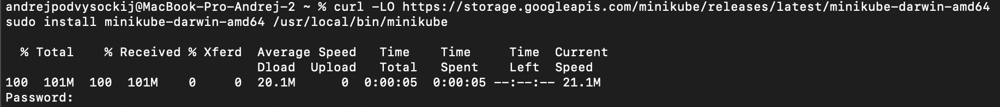
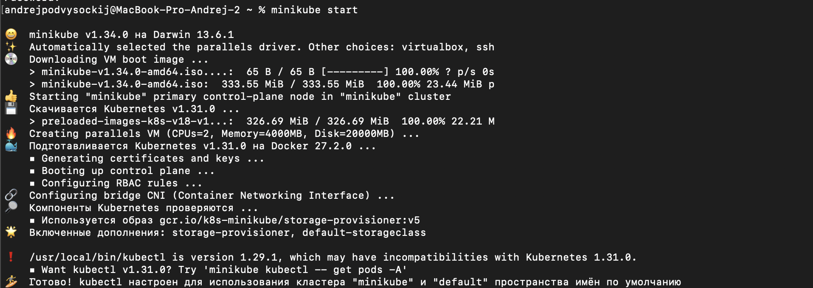
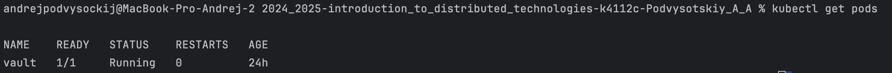
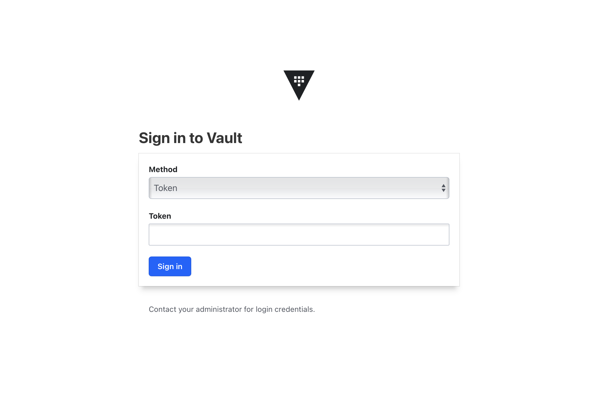
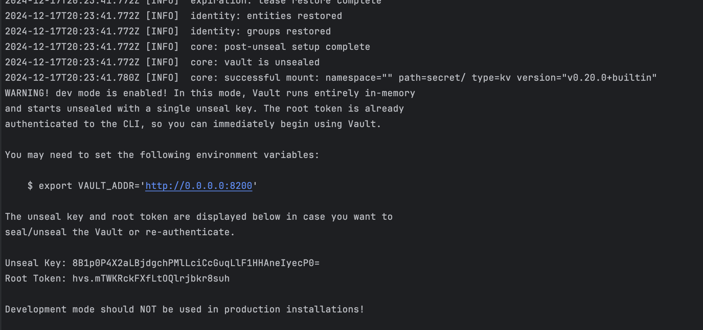
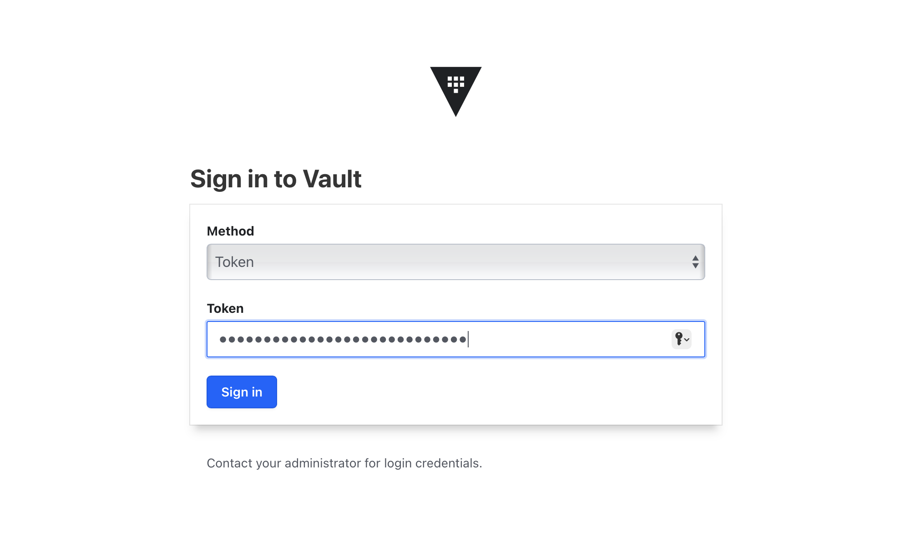
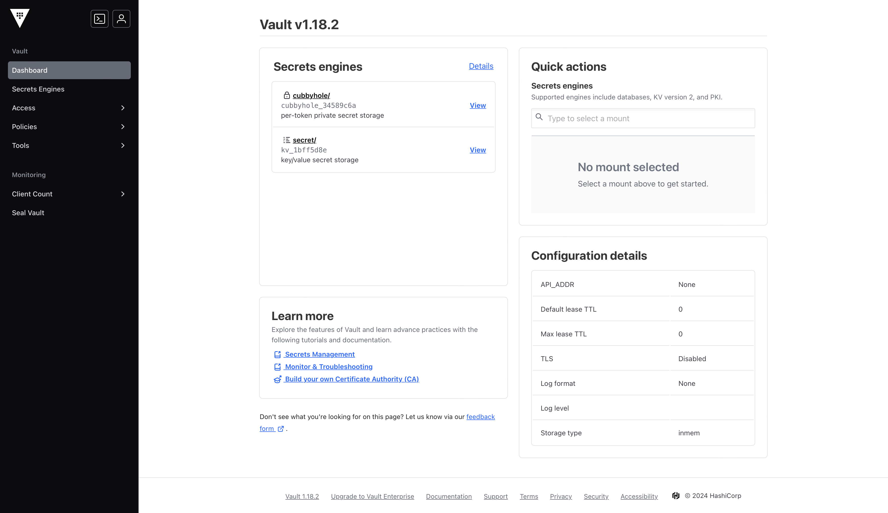
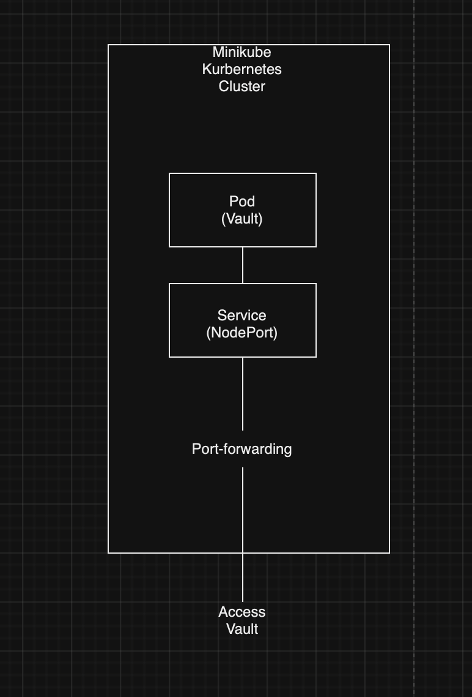

University: [ITMO University](https://itmo.ru/ru/)
Faculty: [FICT](https://fict.itmo.ru)
Course: [Introduction to distributed technologies](https://github.com/itmo-ict-faculty/introduction-to-distributed-technologies)
Year: 2023/2024
Group: K4112c
Author: Podvysotskiy Andrey Anatolievich
Lab: Lab1
Date of create: 10.09.2024
Date of finished: 19.09.2024

# Отчет по лабораторной работе №1

## Ход работы

### Шаг 1

Был установлен Minikube с помощью команды из оригинальной инструкции оригинальной инструкции:

```bash
curl -LO https://storage.googleapis.com/minikube/releases/latest/minikube-darwin-amd64
sudo install minikube-darwin-amd64 /usr/local/bin/minikube
```



После этого развернут minikube cluster.

```bash
minikube start
```



Установлен minicube kubectl

```bash
minicube kubectl
```


### Шаг 2

Создал файл манифеста с именем vault-pod.yaml со следующим кодом для развертывания "пода" HashiCorp Vault:

```yaml
apiVersion: v1
kind: Pod
metadata:
  name: vault
  labels:
    app: vault
spec:
  containers:
    - name: vault
      image: hashicorp/vault:latest
      ports:
        - containerPort: 8200
```

### Шаг 3

Создал под на основе манифеста следующей командой:

```bash
kubectl apply -f vault-pod.yaml
```

Проверил статус работы пода

```bash
kubectl get pods 
```



### Шаг 4

Пробросил порты для доступа к Vault по ссылке http://localhost:8200

```bash
kubectl port-forward pod/vault 8200:8200
```



### Шаг 5

Чтобы получить доступ к логам пода с Vault воспользоваться командной:

```bash
kubectl logs pod/vault
```

Из логов можно достать root токен для доступа к Vault



Воспользовался им для входа:






## Диаграмма

