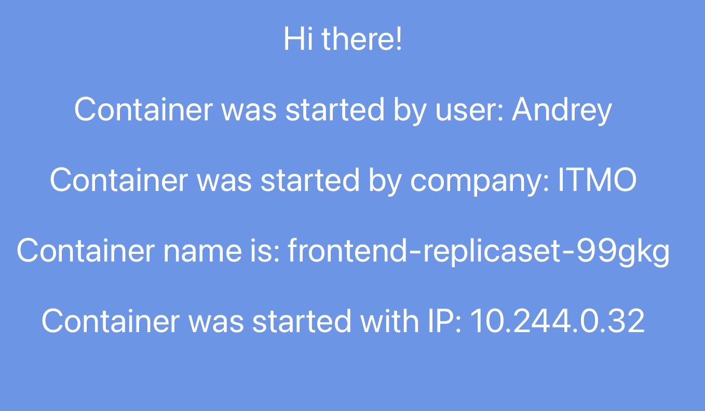

# Отчет по лабораторной работе №1

## Ход работы

### Шаг 1

Создаем манифест для deployment

```yaml
apiVersion: apps/v1
kind: Deployment
metadata:
  name: frontend-deployment
spec:
  replicas: 2
  selector:
    matchLabels:
      app: frontend
  template:
    metadata:
      labels:
        app: frontend
    spec:
      containers:
        - name: frontend-container
          image: ifilyaninitmo/itdt-contained-frontend:master
          env:
            - name: REACT_APP_USERNAME
              value: "Andrey"
            - name: REACT_APP_COMPANY_NAME
              value: "ITMO"
          ports:
            - containerPort: 3000
```

Применяем манифест

```bash
kubectl apply -f deployment.yaml
```


Проверим что реплики создались

```bash
kubectl get deployments
kubectl get pods
```


### Шаг 2

Создадим манфест для сервиса, который предоставит внешний доступ к поду

```yaml
apiVersion: v1
kind: Service
metadata:
  name: frontend-service
spec:
  selector:
    app: frontend  # Селектор для выбора подов, к которым будет направляться трафик
  ports:
    - protocol: TCP
      port: 3000  # Порт, на котором будет доступен сервис
      targetPort: 3000  # Порт, на котором контейнер слушает
      nodePort: 30080  # Порт на узле Minikube для доступа
  type: NodePort
```

Применим манифест

```bash
kubectl apply -f service.yaml
```


### Шаг 3

Теперь подключимся к контейнерам через браузер. Для этого выполним команду:

```bash
minikube service frontend
```


Minikube запустил туннелирование для сервиса



Переменная ContainerName меняется при перезапуске страницы. Так как у нас две реплики, Kubernetes направляет мой запрос на одну из двух реплик


## Диаграмма

