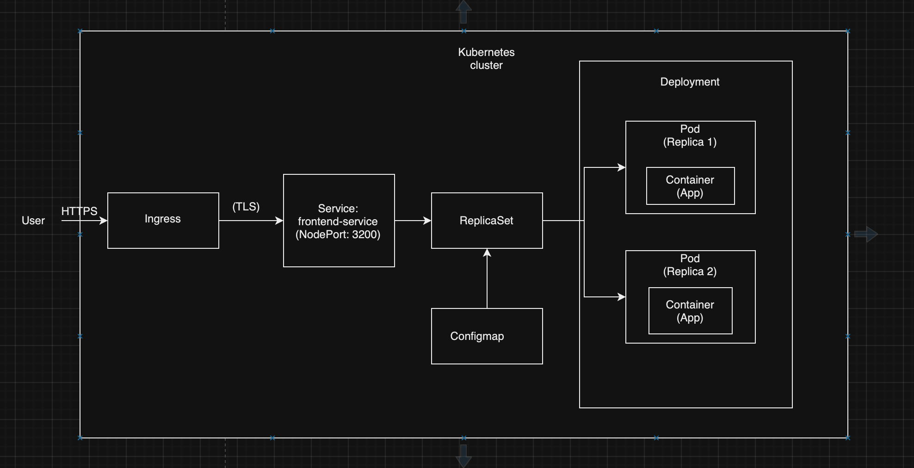

# Отчет по лабораторной работе №3

## Ход работы

### Шаг 1

Создадим файл манифеста для данных конфигурации

```yaml
apiVersion: v1
kind: ConfigMap
metadata:
  name: app-config
data:
  REACT_APP_USERNAME: "Andrey"
  REACT_APP_COMPANY_NAME: "ITMO"
```

Применим

```bash
kubectl apply -f configmap.yaml
```


### Шаг 2

Создадим манфиест для реплик контейнера и передадим туда данные из конфига

```yaml
apiVersion: apps/v1
kind: ReplicaSet
metadata:
  name: frontend-replicaset
spec:
  replicas: 2
  selector:
    matchLabels:
      app: frontend
  template:
    metadata:
      labels:
        app: frontend
    spec:
      containers:
        - name: frontend
          image: ifilyaninitmo/itdt-contained-frontend:master
          env:
            - name: REACT_APP_USERNAME
              valueFrom:
                configMapKeyRef:
                  name: app-config
                  key: REACT_APP_USERNAME
            - name: REACT_APP_COMPANY_NAME
              valueFrom:
                configMapKeyRef:
                  name: app-config
                  key: REACT_APP_COMPANY_NAME
```

Применим

```bash
kubectl apply -f replicaset.yaml
```


### Шаг 3

Теперь нужно настроить TLS сертификат. Для этого включим Ingress в multikube

```bash
minikube addons enable ingress
```


Теперь сгенерируем TLS сертификат

```bash
openssl req -newkey rsa:2048 -nodes -keyout tls.key -x509 -days 365 -out tls.crt -subj "/CN=andrey.itmo.com"
```


Создадим секрет для хранения сертификата

```bash
kubectl create secret tls tls-secret --key tls.key --cert tls.crt
```


### Шаг 4

Создадим манифест для Ingress с использованием нашего сертификата

```yaml
apiVersion: networking.k8s.io/v1
kind: Ingress
metadata:
  name: frontend-ingress
  annotations:
    nginx.ingress.kubernetes.io/ssl-redirect: "true"
spec:
  tls:
    - hosts:
        - andrey.itmo.com
      secretName: tls-secret
  rules:
    - host: andrey.itmo.com
      http:
        paths:
          - path: /
            pathType: Prefix
            backend:
              service:
                name: frontend-service
                port:
                  number: 80
```

Применим


### Шаг 4

Настроим доступ к ingress. Для этого запустим тунель

```bash
minikube tunnel
```


Пропишем хосты в файле hosts


### Шаг 5

Теперь можно открыть веб-приложение и проверить сертификат


## Диаграмма




