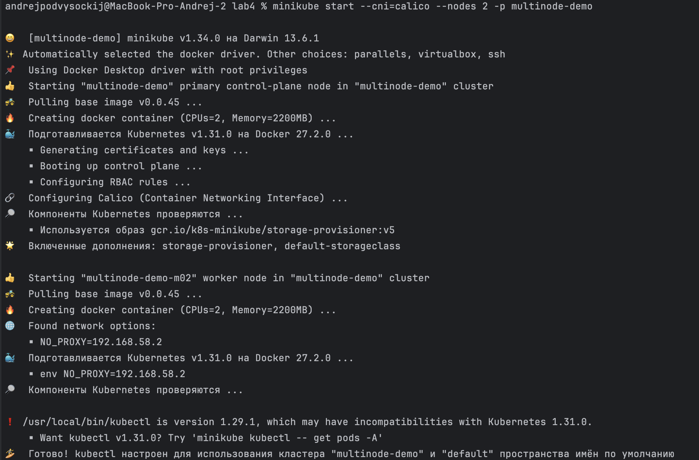
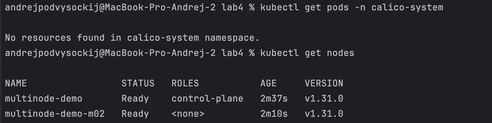
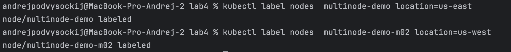
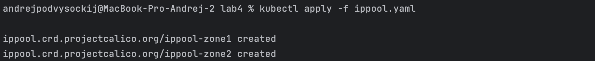
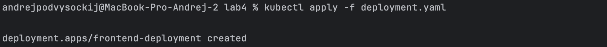
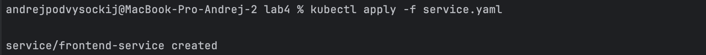
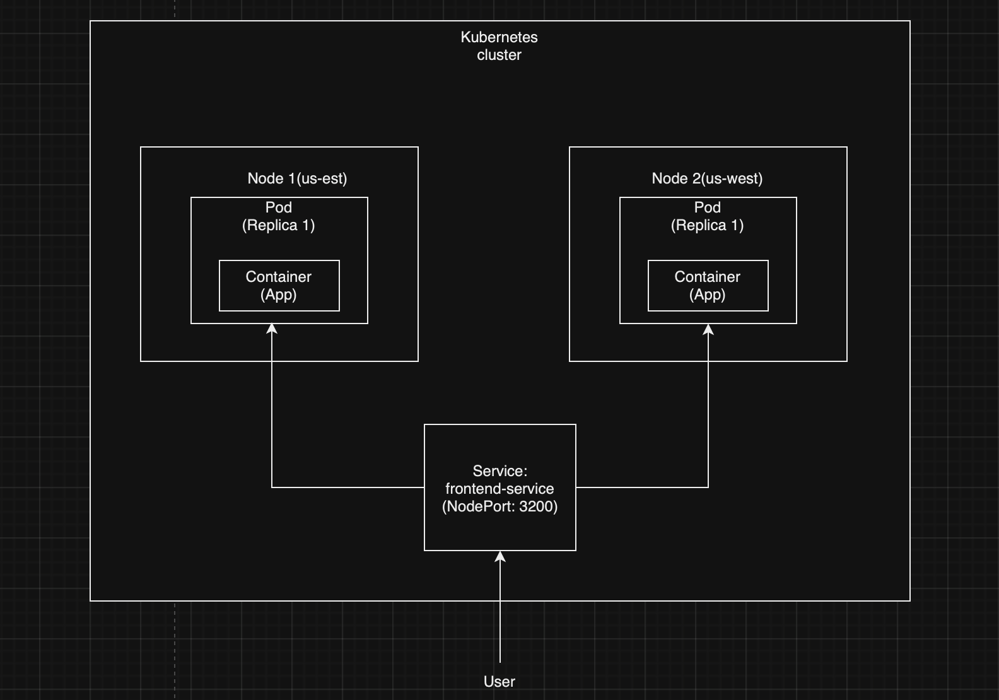

University: [ITMO University](https://itmo.ru/ru/)
Faculty: [FICT](https://fict.itmo.ru)
Course: [Introduction to distributed technologies](https://github.com/itmo-ict-faculty/introduction-to-distributed-technologies)
Year: 2023/2024
Group: K4112c
Author: Podvysotskiy Andrey Anatolievich
Lab: Lab4
Date of create: 10.09.2024
Date of finished: 19.09.2024

# Отчет по лабораторной работе №4

## Ход работы

### Шаг 1

Запустим Minikube с Calico и двумя нодами

```bash
minikube start --cni=calico --nodes=2 -p multinode-demo
```



Проверим что создались две ноды

```bash
kubectl get nodes
```



### Шаг 2

Теперь назначим метки нодам по их географическому расположению

```bash
kubectl label nodes multinode-demo location=us-east
kubectl label nodes multinode-demo-m02 location=us-west
```



### Шаг 3

Теперь разработаем манифест IPPool для Calico, который будет назначать IP-адреса подам на основе меток нод.

```yaml
apiVersion: crd.projectcalico.org/v1
kind: IPPool
metadata:
  name: ippool-zone1
spec:
  cidr: 192.168.1.0/24
  nodeSelector: location == 'us-east'
  ipipMode: Always
  natOutgoing: true
---
apiVersion: crd.projectcalico.org/v1
kind: IPPool
metadata:
  name: ippool-zone2
spec:
  cidr: 192.168.2.0/24
  nodeSelector: location == 'us-west'
  ipipMode: Always
  natOutgoing: true

```

Применим

```bash
kubectl apply -f ippool.yaml
```



### Шаг 4

Теперь создадим манифесты deployment и service

```yaml
apiVersion: apps/v1
kind: Deployment
metadata:
  name: frontend-deployment
spec:
  replicas: 2
  selector:
    matchLabels:
      app: frontend
  template:
    metadata:
      labels:
        app: frontend
    spec:
      affinity:
        nodeAffinity:
          requiredDuringSchedulingIgnoredDuringExecution:
            nodeSelectorTerms:
              - matchExpressions:
                  - key: location
                    operator: In
                    values:
                      - us-east
              - matchExpressions:
                  - key: location
                    operator: In
                    values:
                      - us-west
      containers:
        - name: frontend
          image: ifilyaninitmo/itdt-contained-frontend:master
          ports:
            - containerPort: 3000
          env:
            - name: REACT_APP_USERNAME
              value: "Andrey"
            - name: REACT_APP_COMPANY_NAME
              value: "ITMO"
```

```yaml
apiVersion: v1
kind: Service
metadata:
  name: frontend-service
spec:
  selector:
    app: frontend
  ports:
    - protocol: TCP
      port: 80
      targetPort: 3000
  type: NodePort
```

Применим

```bash
kubectl apply -f deployment.yaml
```



```bash
kubectl apply -f service.yaml
```



### Шаг 5

Теперь проверим их работу


## Схема

